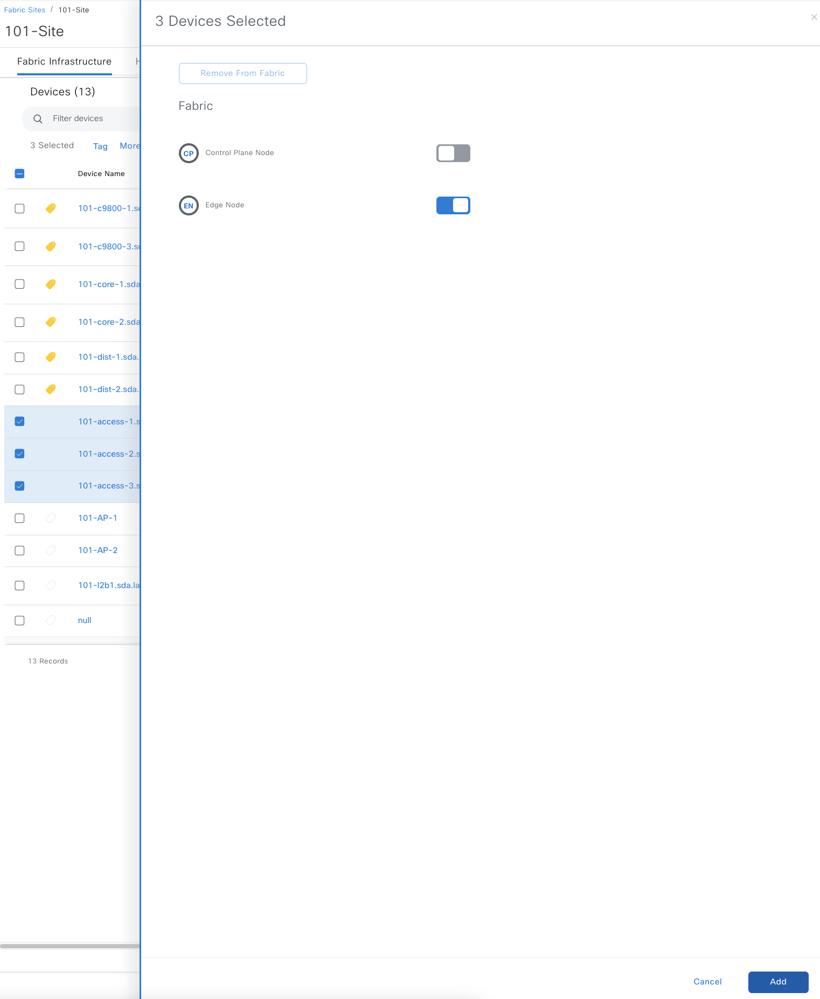

# Introduction to Template-Based SDA Underlay Provisioning
While Catalyst Center offers turnkey underlay fabric automation solution (LAN Automation), sometimes additional configuration flexibility is required, such as:
- Ability to configure OSPFv2 instead of IS-IS as the routing protocol of choice for the underlay.
- Requirement to implement multi-area IGP (both for IS-IS or OSPF) for scaling purposes.
- Requirement for SDA Transit with unified set of underlay multicast RPs.
- Requirement to have tight control of IP addressing allocation for point-to-point links and switch loopback interfaces.

While all of the above can be accomplished just by manual underlay configuration via CLI, this approach does not scale when you need to configure hundreds of the switches. As such, the Catalyst Center templates had been developed to automate fabric underlay provisioning, using OSPFv2 and giving flexibility with multi-area OSPF design, IP address allocations and Anycast RP assignment. The templates can be used as a starting point and modified according to the specific deployment needs.

The templates assume the configuration of downlink interfaces on distribution switches. If the topology is collapsed core, the Day-1 template can be used to automate downlink interfaces on core switches. In both cases, it is assumed that site core switches are already configured (uplinks to fusion, loopback0 interfaces, OSPF, BGP handoff for GRT) and are enabled as SDA site BN+CP.

# SDA Fabric Underlay Goals
- SDA fabric underlay supports IPv4 only addressing only (Dec 2023).
- Each fabric-enabled switch needs to have Loopback0 interface with /32 IPv4 address assigned to it. This interface will act as VTEP in the fabric. In a traditional 3-tier architecture, core and access switches will be fabric-enabled. Distribution switches are not fabric-enabled, but still will have Loopback0 interface with /32 address assigned to facilitate management by Catalyst Center.
- Each fabric-enabled switch connects to another switch in the fabric via point-to-point routed link with increased MTU to accommodate VXLAN overhead.
- All fabric switches will run an instance of Interior Gateway Protocol (OSPFv2 in this case) to facilitate the exchange of Loopback0 host routes within the IGP domain (fabric site).
- All fabric switches will be multicast-enabled (PIM sparse, SSM) with Anycast RPs configured at network core switches (fabric control plane / border nodes).

# How to use these templates

## High-Level Workflow
1. Provision downlink interfaces on two distribution switches (as typically they are deployed in pairs) using DayN template "Underlay Automation - Seed". Each switch will use its own automation subnet to carve /30 addresses for routed interfaces. First address is assigned to the distribution switch routed interface. Each switch will have an option to assign OSPF area ID to the interfaces being provisioned. If multi-area OSPF design is not required, use area 0 everywhere.
2. During provisioning, an option is presented to designate one switch as primary. Never assign both switches as primary. Primary switch will have DHCP pool with the corresponding second address for /30 subnet, intended to facilitate Plug and Play (PnP) provisioning of access switches.
3. Once downlink interfaces are provisioned, the access layer switches will receive the address via DHCP from primary distribution switch, connect to Catalyst Center and present themselves in PnP workflow.
4. Once there, claim the switch(es), assign Day0 template "Underlay Automation - Edge", populate Loopback0 IP addresses, assign OSPF area ID and multicast RP address. OSPF area ID needs to match previously configured area ID on distribution switches.
5. Once PnP provisioning is completed and switch is assigned to the respective Catalyst Center site, provision switch from the inventory to push site-specific AAA settings and switch is ready for SDA fabric enablement.
6. Enable SDA Edge Node role on the switch.

## Prerequisites
- Site automation subnets and Loopback0 subnets are advertised to Fusion device.
- Catalyst Center can reach hosts in these subnets to facilitate PnP workflow.
- Fabric site is created in Catalyst Center and core switches are  configured for underlay (OSPFv2, PIM, MSDP, BGP)
- Core switches are enabled for SDA BN and CP roles.

## Topology

## Detailed Steps

1. Import UnderlayAutomation-Seed.json as Day-N template and assign to the site profile in Catalyst Center. It as assumed that device tag "underlay_seed" is created and mapped to the template to facilitate template to switch attachment (tag a switch, then template with the tag is applied during switch provisioning step).

2. After import, navigate to template variables section and update Catalyst Center IP address variable (DNACip) to match your Catalyst Center Enterprise VIP address.

3. Navigate to Catalyst Center Inventory, tag two distribution switches as "underlay_seed", then provision (Actions->Provision->Provision Device) the switches.

Select the primary seed, downlink interfaces to be automated, assign the automation ranges and OSPF area ID.

Repeat the same for secondary seed.

4. After provisioning, SSH to primary and secondary seed switches and verify the creation of DHCP pools and corresponding interfarces.

5. Import UnderlayAutomation-Edge.json as Day-0 template into "Onboarding Configuration" project. Once imported, assign it as Day 0 template in the network profile attached to the site profile.

6. Connect the access switches (if not done already) by dual-homing them to distribution switches. Once switches boot up and obtain DHCP address from the pools on primary seed, they will appear in Catalyst Center Plug and Play menu.

7. Select the switches, click "Claim", assign switch hostnames and assign to the Catalyst Center site.

8. At the next step, populate the variables:
- Multicast RP: this is underlay anycast RP, should be either site local BN/CP loopback0 interface or centralised RP in case of SDA Transit.
- Management IP address: this is switch Loopback0 interface IP address.
- OSPF area ID: this value should match the previously configured OSPF area ID variable on distribution switches.

Kick off the switch claim process.

9. Once PnP process is finished, locate the switches in Catalyst Center site and provision them.

This process will push ISE configuration to the switch and will create TrustSec relations between ISE and the switch.

10. Once provisioning is completed, enable fabric Edge node role on the switch in the fabric infrastructure view.

